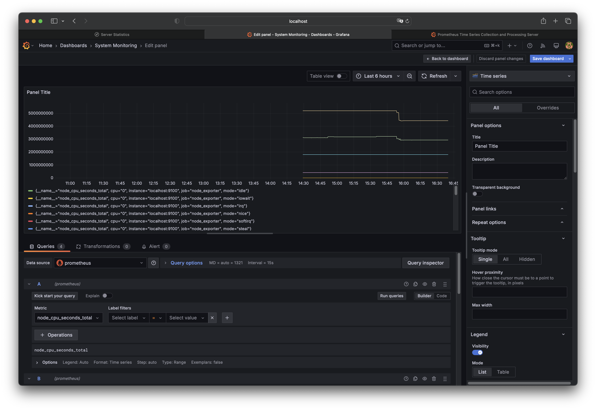
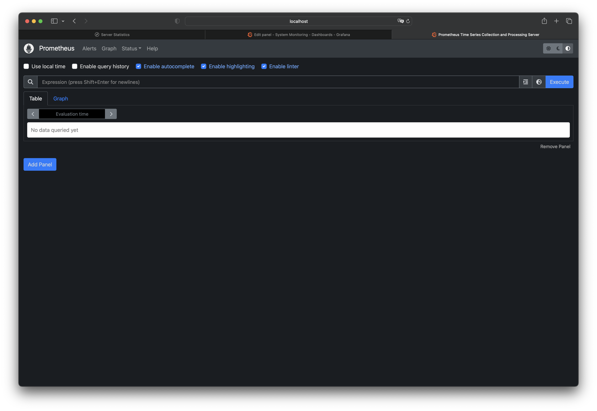
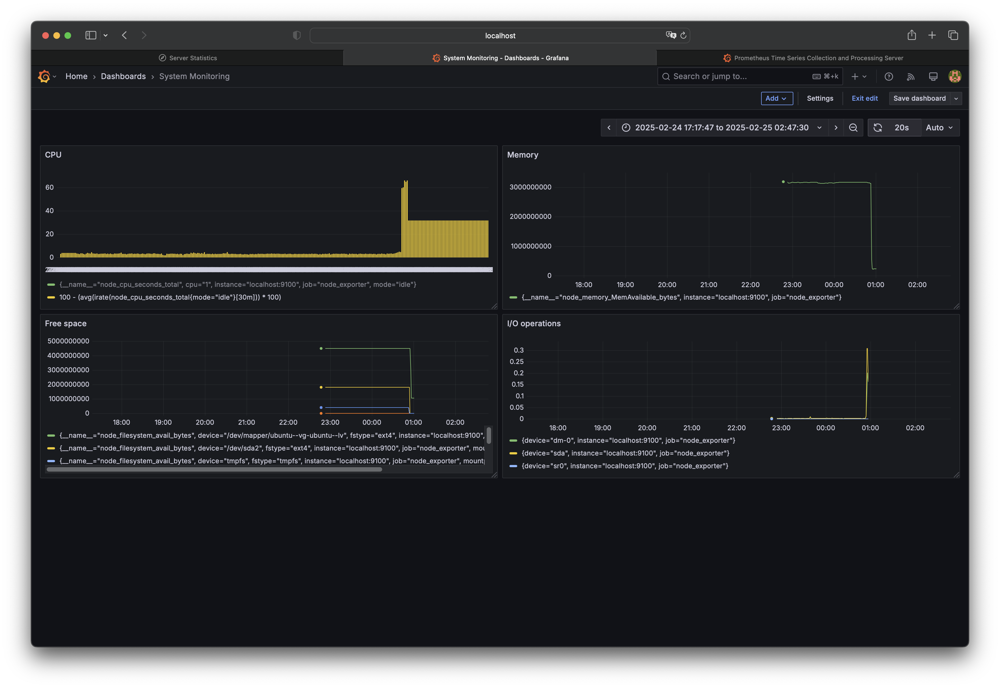
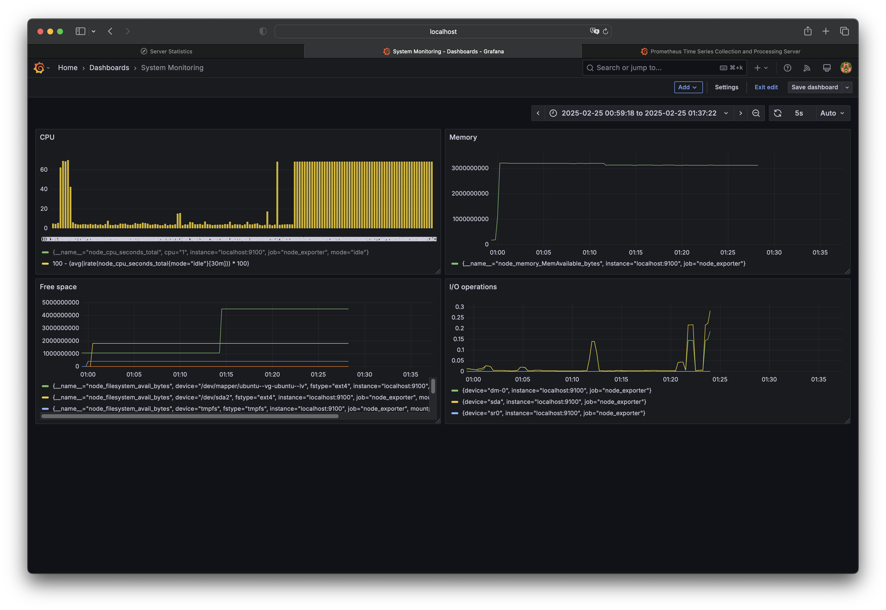

## Part 7. **Prometheus** и **Grafana**

Практика с логами пока что окончена. Теперь пришло время мониторить состояние системы в целом.

**== Задание ==**

##### Установи и настрой **Prometheus** и **Grafana** на виртуальную машину.
`wget https://github.com/prometheus/prometheus/releases/download/v2.47.0/prometheus-2.47.0.linux-amd64.tar.gz`

`tar -xvzf prometheus-2.47.0.linux-amd64.tar.gz`

`cd prometheus-2.47.0.linux-amd64`

`./prometheus --config.file=prometheus.yml`

`wget https://github.com/prometheus/node_exporter/releases/download/v1.6.1/node_exporter-1.6.1.linux-amd64.tar.gz`

`tar -xvzf node_exporter-1.6.1.linux-amd64.tar.gz`

`cd node_exporter-1.6.1.linux-amd64`

`./node_exporter`

`wget https://dl.grafana.com/enterprise/release/grafana-enterprise_11.5.2_amd64.deb`

`sudo dpkg -i grafana-enterprise_11.5.2_amd64.deb`

`systemctl enable grafana-server`

`systemctl start grafana-server`
##### Получи доступ к веб-интерфейсам **Prometheus** и **Grafana** с локальной машины.

`http://localhost:3000`

`http://localhost:9090`

##### Добавь на дашборд **Grafana** отображение ЦПУ, доступной оперативной памяти, свободное место и кол-во операций ввода/вывода на жестком диске.

##### Запусти свой bash-скрипт из [Части 2](#part-2-засорение-файловой-системы).
##### Посмотри на нагрузку жесткого диска (место на диске и операции чтения/записи).

##### Установи утилиту **stress** и запусти команду `stress -c 2 -i 1 -m 1 --vm-bytes 32M -t 10s`

`sudo apt-get install stress`

##### Посмотри на нагрузку жесткого диска, оперативной памяти и ЦПУ.
