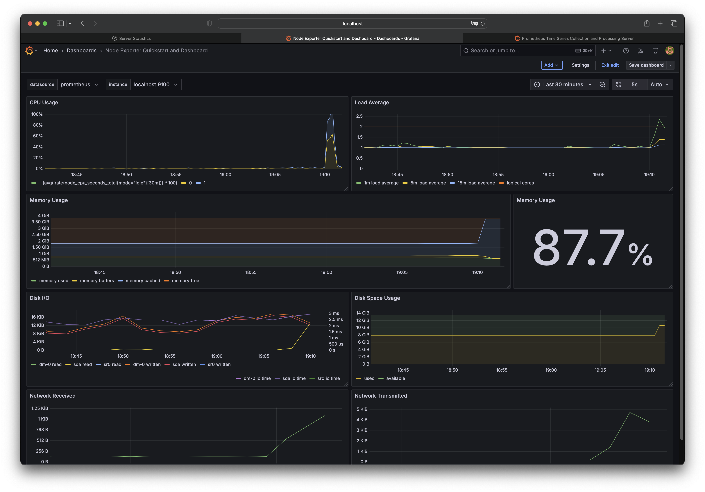
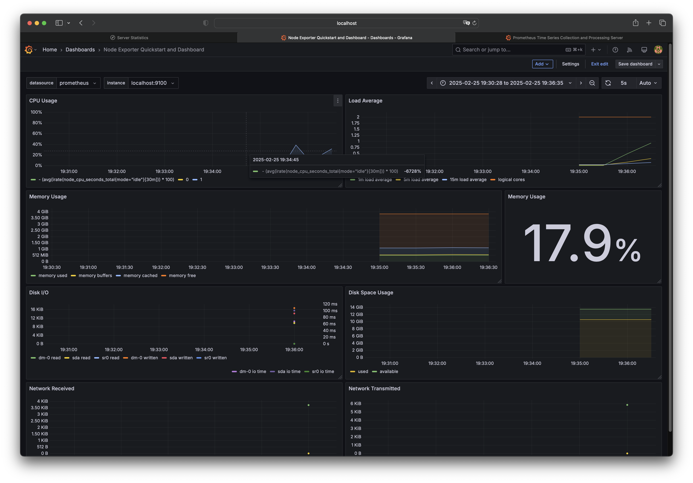
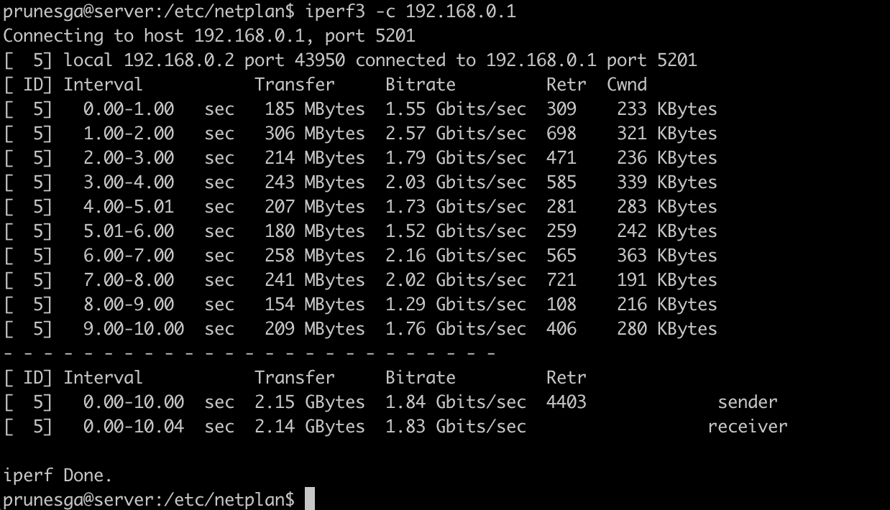
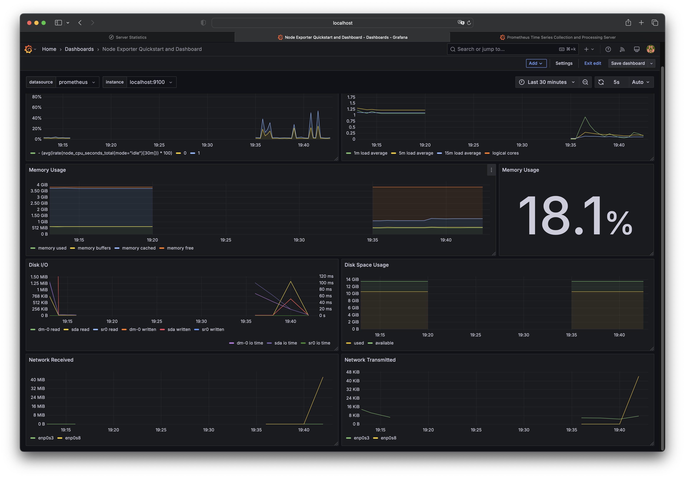

## Part 8. Готовый дашборд

Собственно, зачем составлять собственный дашборд, если, как говорится, «всё уже украдено до нас»?
Почему бы не взять готовый дашборд, на котором есть все нужные метрики?

**== Задание ==**

##### Установи готовый дашборд *Node Exporter Quickstart and Dashboard* с официального сайта **Grafana Labs**.

##### Проведи те же тесты, что и в [Части 7](#part-7-prometheus-и-grafana).

##### Запусти ещё одну виртуальную машину, находящуюся в одной сети с текущей.
##### Запусти тест нагрузки сети с помощью утилиты **iperf3**.
`sudo apt-get install iperf3`
На первой машине запускаем:
`iperf3 -s`
На второй машине запускаем:
iperf3 -c 192.168.0.1

##### Посмотри на нагрузку сетевого интерфейса.
