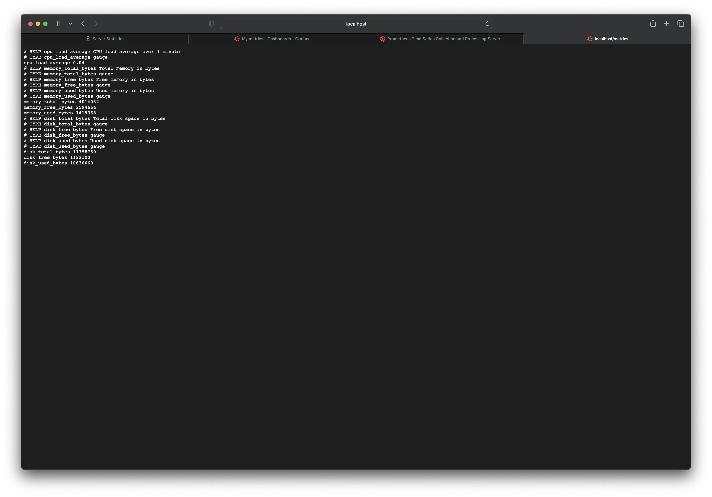
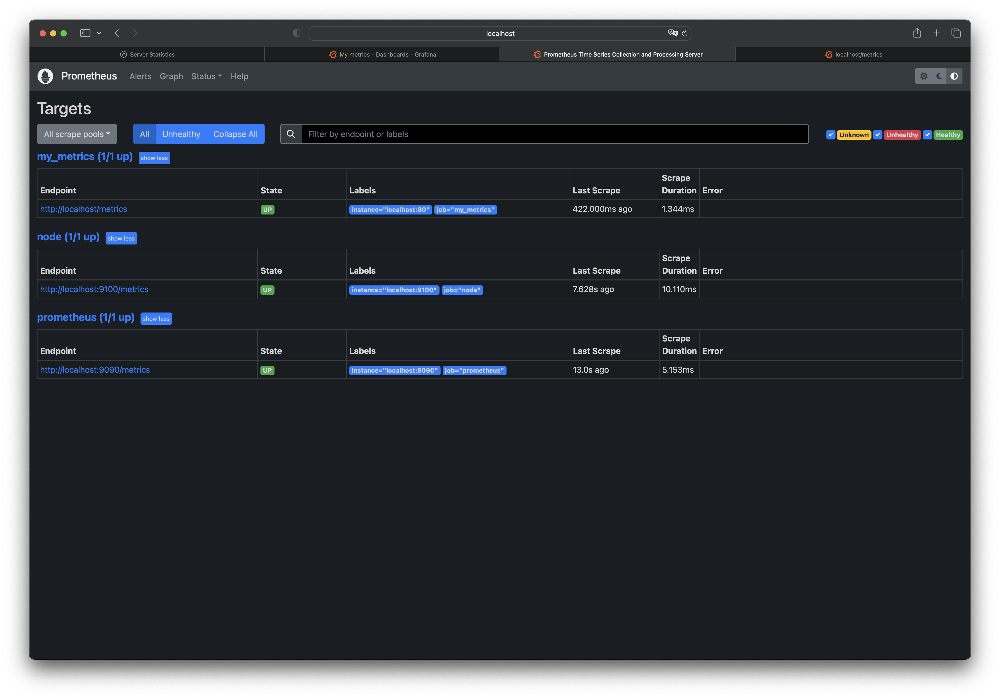
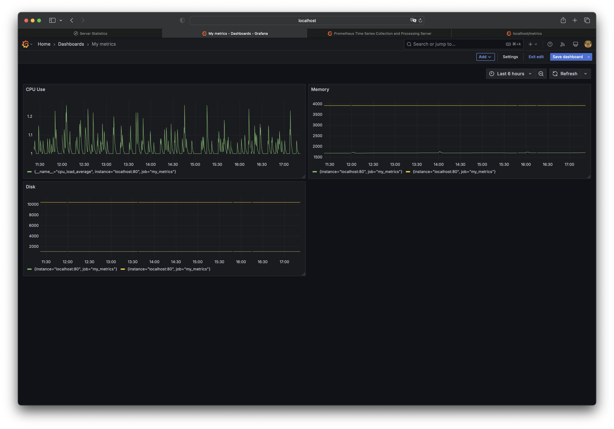
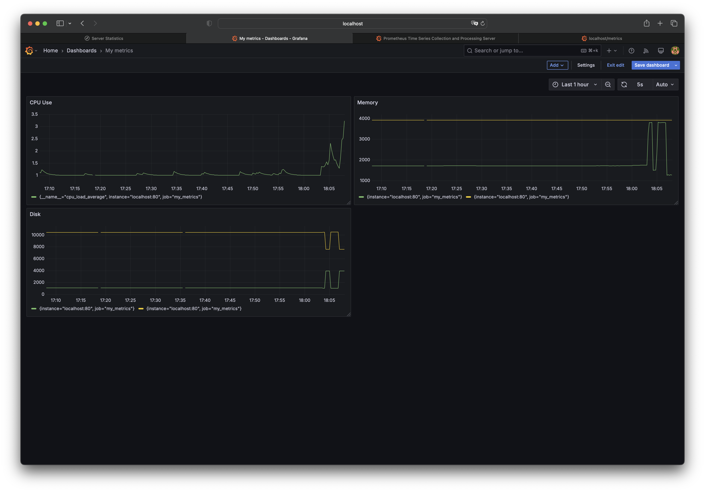

## Part 9. Дополнительно. Свой *node_exporter*

Анализировать систему с помощью специальных утилит полезно и удобно, но тебе всегда хотелось понять, как же они работают.

**== Задание ==**

Напиши bash-скрипт или программу на С, собирающие информацию по базовым метрикам системы (ЦПУ, оперативная память, жесткий диск (объем)).
`sudo apt-get install nginx`
`sudo nano /etc/nginx/sites-available/default`
`sudo systemctl restart nginx`
Скрипт или программа должна формировать html страничку по формату **Prometheus**, которую будет отдавать **nginx**. \

Саму страничку обновлять можно как внутри bash-скрипта или программы (в цикле), так и при помощи утилиты cron, но не чаще, чем раз в 3 секунды.

##### Поменяй конфигурационный файл **Prometheus**, чтобы он собирал информацию с созданной тобой странички.

##### Проведи те же тесты, что и в [Части 7](#part-7-prometheus-и-grafana).

